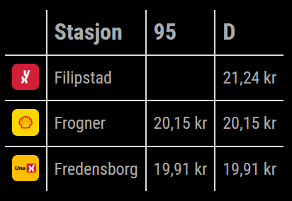

# MMM-Bensinpriser
MMM-Bensinpriser is a MagicMirror² module that displays fuel prices for your nearest gas stations in Norway.

> [!IMPORTANT]  
> This project is no longer maintained. The API it depends on no longer works, so the functionality is broken. Feel free to open an issue if you have an idea on how to get it working again.



## Installation
1. Clone the MMM-Bensinpriser repository into the `modules` directory of your MagicMirror²:
   ```bash
   git clone https://github.com/ItsMeBrille/MMM-Bensinpriser.git
   ```

## Configuration
To use MMM-Bensinpriser, add it to the `modules` array in the `config/config.js` file of your MagicMirror installation:
```javascript
{
  module: "MMM-Bensinpriser",
  position: "bottom_left",
  config: {
    apiKey: "24ACBFDD74F54688B46D425104009AD9FC48CEBC-A",
    coordinates: {
      latitude: 59.910981, // Aker Brygge latitude, Oslo
      longitude: 10.727169, // Aker Brygge longitude, Oslo
    },
    numberOfStations: 3,
    updateInterval: 180, // Update interval in minutes
    fuelTypes: ["95", "D"], // The fuel types you want to display (95, 98, 100, D, FD or EN590)
    decimalSeparator: "." // You can set it to "." or ","
  }
},
```
Replace `YOUR_API_KEY` with your API key for the fuel price data, or use the one provided.

## Usage
The module will display a table with fuel prices for the nearest gas stations based on the specified coordinates. The table will update at the configured interval.

The language is set by the global `language` field in your config.js. (nb or en)

## Dependencies
* MagicMirror² (not tested on versions below 2.12.0)
* API from [DrivstoffAppen](https://drivstoffappen.no)

## License
MMM-Keypress is licensed under the [MIT License](LICENSE).
The MIT License (MIT)
